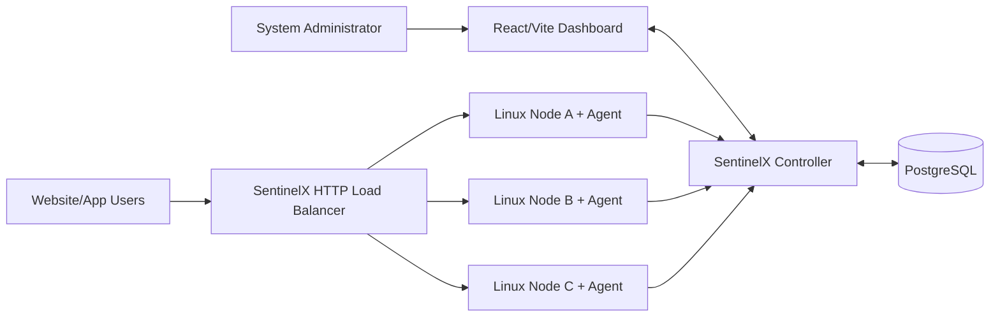

# SentinelX — System Architecture

## 1. Architectural Style

### Controller
**Modular Monolith**

### Separate Runtime Processes
- SentinelX Agent
- SentinelX Load Balancer
- Dashboard

Kiến trúc này được chọn để:
- deployment đơn giản cho nhóm 2 sinh viên;
- debug nhanh;
- demo ổn định;
- giữ module boundary rõ;
- vẫn phản ánh mô hình triển khai của một sản phẩm quản trị hạ tầng thực tế.

---

## 2. System Context



---

## 3. Multi-Host Architecture Requirement

SentinelX là một networked system và **không được thiết kế với giả định tất cả component chạy trên cùng một máy**.

Controller, Agent, Load Balancer và backend workloads phải có khả năng chạy trên các physical machine/VM khác nhau.

Ví dụ:

```text
Machine A — 192.168.1.10
├── SentinelX Controller
├── Dashboard
└── SentinelX Load Balancer

           │
           │ LAN / IP Network
           │
     ┌─────┴─────┐
     │           │
     ▼           ▼

Machine B      Machine C
192.168.1.20   192.168.1.30

Backend01      Backend02
Agent01        Agent02
```

### Architecture MUST NOT assume

```text
Controller Host == Agent Host
```

```text
Load Balancer Host == Backend Host
```

```text
All Services == localhost
```

```text
All Nodes == Same Docker Host
```

### Network addresses must be configurable

Tối thiểu:

- Controller bind host;
- Controller port;
- Agent Controller URL;
- LB listen host;
- LB listen port;
- backend host/IP;
- backend port.

`localhost` hoặc Docker service name có thể được dùng trong development profile, nhưng không được hard-code thành application assumption.

---

## 4. Controller Architecture

```text
sentinelx_controller/
├── api/
├── modules/
│   ├── system/
│   ├── projects/
│   ├── nodes/
│   ├── telemetry/
│   ├── detection/
│   ├── incidents/
│   ├── policy/
│   ├── defense/
│   └── recovery/
└── infrastructure/
    ├── database/
    ├── events/
    └── realtime/
```

Controller là một deployment/process nhưng được chia theo business capability.

Một module trưởng thành có thể có:

```text
module/
├── domain/
├── application/
├── infrastructure/
├── router.py
└── public.py
```

Không bắt buộc tạo đủ subfolder khi module còn nhỏ.

---

## 5. Module Communication Rules

Controller module không được truy cập trực tiếp implementation nội bộ hoặc database repository của module khác.

Allowed:

```text
Module A
  ↓
Module B Public Interface
```

hoặc:

```text
Module A
  ↓
Domain/Application Event
  ↓
Module B
```

Forbidden:

```text
Detection
  ↓
Telemetry PostgresRepository Implementation
```

và:

```text
Detector
  ↓
Firewall
```

---

## 6. Agent Architecture

```text
Linux Managed Node

├── Customer Workload / Service
│
└── SentinelX Agent
    ├── Identity Manager
    ├── Enrollment
    ├── Heartbeat
    ├── Resource Collector
    ├── Network Collector
    ├── Network Aggregator
    ├── Telemetry Batcher
    ├── Retry / Buffer
    ├── Controller Client
    ├── Command Processor
    ├── Defense Executor
    └── Recovery Executor
```

Agent:
- chạy độc lập với source code workload;
- chủ động kết nối outbound tới Controller;
- không cần Controller mở kết nối inbound trực tiếp vào Agent cho telemetry;
- giữ local execution boundary cho firewall/recovery.

---

## 7. Agent → Controller Communication

CORE sử dụng:

```text
Agent
  ↓
REST / JSON
  ↓
Controller
```

Telemetry được gửi theo batch.

Lý do:
- đơn giản;
- dễ debug;
- phù hợp multi-host;
- không yêu cầu Agent expose telemetry server;
- hoạt động tốt qua NAT/firewall hơn pull model;
- đủ cho 2–3 node PBL.

Agent Controller URL phải configurable.

Ví dụ multi-host:

```text
Agent B
192.168.1.20
    │
    │ HTTP
    ▼
Controller A
192.168.1.10:8000
```

---

## 8. Controller → Dashboard

Dùng:

- REST cho initial data/history/CRUD;
- WebSocket cho realtime updates.

```text
Dashboard
   │
   ├──── REST ────────► Controller
   │
   ◄── WebSocket ─────┤
```

Dashboard là management interface, không phải lõi kỹ thuật của đề tài.

---

## 9. Event Architecture

Target pipeline:

```text
MetricSample / NetworkFeature
          ↓
Detector
          ↓
DetectionEvent
          ↓
PolicyEngine
          ↓
DefenseAction
          ↓
DefenseCoordinator
          ↓
Agent Command
          ↓
DefenseExecutor
          ↓
ActionResult
          ↓
RecoveryEvent
```

Nguyên tắc:

> Detector phát hiện và phát event. Detector không trực tiếp thực thi firewall hoặc restart service.

---

## 10. Control Plane, Node Plane và Traffic Plane

### Control Plane
- Controller
- PostgreSQL
- Dashboard
- detection coordination
- policy
- incident
- defense coordination
- recovery coordination

### Node / Execution Plane
- SentinelX Agent
- Linux OS
- process/service
- telemetry
- network observation
- local nftables
- local recovery execution

### Traffic Plane
- SentinelX Load Balancer
- backend pool
- HTTP forwarding
- health checks
- routing state

---

## 11. Load Balancer Architecture

CORE Load Balancer là **custom HTTP reverse proxy**, runtime/service riêng.

```text
Client
  ↓
HTTP Listener
  ↓
Request Handler
  ↓
Backend Selector
  ├── Round Robin
  └── Least In-Flight
  ↓
Proxy Client
  ↓
Remote Backend
```

Các component:

```text
sentinelx_lb/
├── proxy/
├── algorithms/
├── registry/
├── health/
└── admin/
```

Backend address không được hard-code.

Ví dụ:

```text
backend01 = 192.168.1.20:9000
backend02 = 192.168.1.30:9000
```

---

## 12. Health and Routing State

Không trộn health state với routing state.

### Health State
- HEALTHY
- SUSPECT
- UNHEALTHY
- RECOVERING

### Routing State
- ENABLED
- EJECTED
- DRAINING

Flow:

```text
HEALTHY
  ↓ failures
SUSPECT
  ↓ failure threshold
UNHEALTHY
  ↓
EJECTED
  ↓ successful probes
RECOVERING
  ↓ success threshold
HEALTHY + ENABLED
```

---

## 13. Network Collection Boundary

CORE target:

```text
Packet Observation
      ↓
Scapy / libpcap
      ↓
BPF/filter when appropriate
      ↓
Sliding Window Aggregation
      ↓
NetworkFeature
      ↓
Controller
```

Không gửi/lưu raw packet payload hàng loạt vào PostgreSQL.

Ưu tiên aggregated network feature phục vụ:
- Port Scan;
- SYN rate;
- connection anomalies;
- flow statistics.

---

## 14. Defense Boundary

Quyết định kiến trúc:

> **Controller decides — Agent executes.**

```text
DetectionEvent
      ↓
PolicyEngine
      ↓
DefenseAction
      ↓
Controller persists/authorizes action
      ↓
Agent receives command
      ↓
Agent performs local safety validation
      ↓
nftables / local executor
      ↓
ActionResult
      ↓
Controller audit
```

Controller không SSH vào node để sửa firewall.

---

## 15. Storage Boundary

CORE sử dụng PostgreSQL.

Nhóm dữ liệu:

### Persistent Domain Records
- projects;
- nodes;
- agents;
- incidents;
- policies;
- defense actions;
- whitelist;
- block history;
- LB pools/backends.

### Telemetry
- metric samples;
- network features;
- health-check results.

CORE không yêu cầu specialized TSDB.

---

## 16. PBL Development Architecture

Docker Compose được dùng để xây môi trường tái lập:

```text
Developer Host

├── Controller
├── PostgreSQL
├── Dashboard
├── SentinelX LB
├── Backend01
├── Backend02
├── Backend03
├── Traffic Generator
└── Attack Simulator
```

Đây là development/integration lab, không phải giới hạn kiến trúc.

---

## 17. PBL Multi-Host Architecture

Final architecture phải chứng minh được deployment qua IP network.

Tối thiểu:

```text
Machine A
Controller + Dashboard + LB

        │
        │ LAN
        ▼

Machine B
Backend + Agent
```

Khuyến nghị:

```text
Machine A
Controller + Dashboard + LB

       ┌───────────────┐
       │               │
       ▼               ▼

Machine B          Machine C
Backend01          Backend02
Agent01            Agent02
```

Không cần production cloud deployment để chứng minh multi-host; LAN là đủ cho PBL network demonstration.

---

## 18. Phase 2 Boundary

Không đưa vào CORE trước khi baseline hoàn thành:

- Isolation Forest;
- Adaptive Load Balancing;
- advanced EWMA/Z-score;
- eBPF;
- tc;
- advanced cgroups;
- specialized TSDB;
- Microservices;
- distributed Controller;
- HA architecture.
