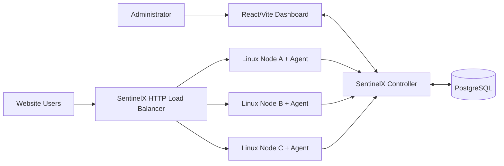

# SentinelX — System Architecture

## 1. Architectural Style

### Controller
**Modular Monolith**

### Separate runtime processes
- Agent
- Load Balancer
- Dashboard

Điều này cho phép:
- deployment đơn giản;
- debug dễ;
- module boundary rõ;
- vẫn phản ánh cách sản phẩm thật được triển khai.

---

## 2. High-level Architecture



---

## 3. Controller Modules

```text
sentinelx_controller/
├── api/
├── modules/
│   ├── system/
│   ├── projects/
│   ├── nodes/
│   ├── telemetry/
│   ├── detection/
│   ├── incidents/
│   ├── policy/
│   ├── defense/
│   └── recovery/
└── infrastructure/
    ├── database/
    ├── events/
    └── realtime/
```

Mỗi module trưởng thành theo feature:

```text
feature/
├── domain/
├── application/
├── infrastructure/
├── router.py
└── public.py
```

Không bắt buộc tạo đủ các subfolder nếu module còn rất nhỏ.

---

## 4. Main Runtime Boundaries

### Agent
```text
Linux Node
  |
  +-- Customer Backend
  |
  +-- SentinelX Agent
        |
        +-- Resource Collector
        +-- Network Collector
        +-- Batcher
        +-- Controller Client
        +-- Command Processor
        +-- Defense/Recovery Executor
```

### Controller
```text
API
 |
 v
Application Modules
 |
 +--> PostgreSQL
 |
 +--> Realtime Hub
 |
 +--> Detection/Policy/Defense pipeline
```

### Load Balancer
```text
Client
  |
  v
HTTP Listener
  |
  v
Backend Selector
  |
  +--> Round Robin
  +--> Least In-Flight
  |
  v
HTTP Proxy
  |
  v
Backend Pool
```

---

## 5. Event Architecture

Target business flow:

```text
MetricSample / NetworkFeature
          |
          v
Detector
          |
          v
DetectionEvent
          |
          v
PolicyEngine
          |
          v
DefenseAction
          |
          v
DefenseCoordinator
          |
          v
Agent Command
          |
          v
DefenseExecutor
          |
          v
ActionResult / RecoveryEvent
```

Detector không được gọi firewall trực tiếp.

---

## 6. Communication Decisions

| Producer | Consumer | Protocol / Mechanism |
|---|---|---|
| Agent | Controller | REST/JSON push |
| Agent | Controller | batched telemetry |
| Dashboard | Controller | REST |
| Controller | Dashboard | WebSocket realtime |
| Controller module | Controller module | public interface/direct call |
| Controller module | Controller module | in-process async event khi phù hợp |
| Controller | PostgreSQL | SQLAlchemy/async PostgreSQL |
| LB | Backends | HTTP |
| Controller | LB | local/internal control API khi milestone yêu cầu |

Không dùng broker trong CORE.

---

## 7. Control Plane vs Data Plane vs Traffic Plane

### Control Plane
- Controller
- Dashboard
- storage
- policy/incident/defense coordination

### Node/Data Plane
- Agent
- Linux metrics
- process/service
- network observation
- nftables execution

### Traffic Plane
- Custom Load Balancer
- backend pool
- health checks
- routing state

---

## 8. Important Boundary: Defense

```text
Controller
  |
  | creates authorized DefenseAction
  v
Agent
  |
  | validates local safety
  v
nftables
```

Controller quyết định.
Agent thực thi.

Không SSH từ Controller để sửa firewall node.

---

## 9. Health vs Routing State

Không trộn health state và routing action.

Health state:
- HEALTHY
- SUSPECT
- UNHEALTHY
- RECOVERING

Routing state:
- ENABLED
- EJECTED
- DRAINING

---

## 10. Phase 2 Boundary

Không đưa vào CORE trước foundation/core baseline:
- Isolation Forest
- Adaptive Load Balancing
- advanced EWMA/Z-score
- eBPF
- tc/cgroups advanced control
- specialized TSDB
- microservices
- distributed deployment
