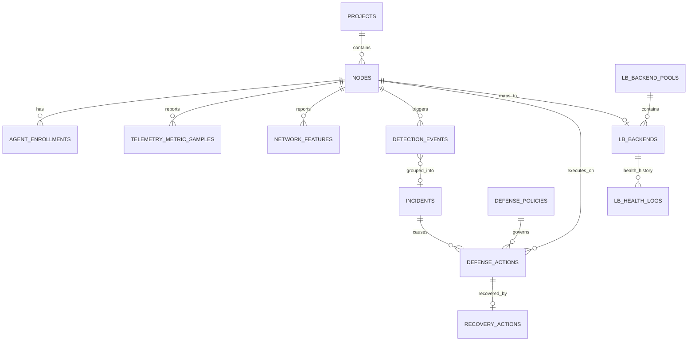

# SentinelX — Database Schema & Entity Specification

> Tài liệu này chuẩn hóa mô hình dữ liệu quan hệ (PostgreSQL RDBMS), sơ đồ thực thể liên kết (ERD) và ràng buộc toàn vẹn cho toàn bộ các module trong hệ thống SentinelX.
> 
> Triển khai vật lý (SQLAlchemy ORM & Alembic migrations) sẽ được đưa vào codebase từng bước theo đúng thứ tự các milestone trong `docs/FOUNDATION_ROADMAP.md`.

---

## 1. Sơ đồ quan hệ thực thể (ERD)



---

## 2. Bảng phân loại Module & Thực thể

| Module / Bounded Context | Tên bảng (Table) | Mục đích lưu trữ | Milestone triển khai |
|---|---|---|---|
| **Projects & Nodes** | `projects` | Dự án / Cụm hạ tầng phân vùng logic | Milestone F5 |
| | `nodes` | Danh sách máy chủ Linux quản trị (Agent Host) | Milestone F5 |
| | `agent_enrollments` | Lịch sử xác thực token, bắt tay kết nối Agent $\rightarrow$ Controller | Milestone F6 |
| **Telemetry** | `telemetry_metric_samples` | Dữ liệu chuỗi thời gian: CPU, RAM, Disk, Network IO | Milestone F8 |
| | `network_features` | Đặc trưng mạng gộp (SYN rate, connection counts, port stats) | Milestone M2 |
| **Detection & Incidents** | `detection_events` | Các sự kiện bất thường do Detector bắn ra | Milestone M3, M4 |
| | `incidents` | Vụ việc / Chu kỳ sự cố tấn công (gom các detection events) | Milestone M5 |
| **Policy & Defense** | `defense_policies` | Quy tắc & chính sách phản ứng (Ngưỡng kích hoạt, Action) | Milestone M5 |
| | `ip_whitelist` | Danh sách IP an toàn nội bộ (CẤM chặn nhầm) | Milestone M5 |
| | `defense_actions` | Lệnh phòng thủ (Block IP nftables, rate-limit, ACK từ Agent) | Milestone M6, M7 |
| **Recovery** | `recovery_actions` | Lịch sử hoàn tác / Unblock IP / Khôi phục dịch vụ | Milestone M8 |
| **Load Balancer** | `lb_backend_pools` | Nhóm backend upstream cho Load Balancer | Milestone F12 |
| | `lb_backends` | Danh sách backend, trạng thái Health (`HEALTHY`) & Routing (`ENABLED/EJECTED`) | Milestone F12, F13 |
| | `lb_health_logs` | Lịch sử active HTTP health check của LB | Milestone F13 |

---

## 3. Chi tiết Cấu trúc Bảng & Khóa (Schema Specs)

### 3.1. Quản trị Hạ tầng & Node (`Projects` & `Nodes`)

```sql
-- 1. projects: Phân vùng quản trị hạ tầng
CREATE TABLE projects (
    id UUID PRIMARY KEY DEFAULT gen_random_uuid(),
    name VARCHAR(100) NOT NULL UNIQUE,
    description TEXT,
    created_at TIMESTAMPTZ NOT NULL DEFAULT NOW(),
    updated_at TIMESTAMPTZ NOT NULL DEFAULT NOW()
);

-- 2. nodes: Các máy chủ Linux được quản trị bởi SentinelX Agent
CREATE TABLE nodes (
    id UUID PRIMARY KEY DEFAULT gen_random_uuid(),
    project_id UUID NOT NULL REFERENCES projects(id) ON DELETE CASCADE,
    hostname VARCHAR(255) NOT NULL,
    ip_address INET NOT NULL,
    os_info VARCHAR(255),
    agent_version VARCHAR(50),
    status VARCHAR(20) NOT NULL DEFAULT 'UNENROLLED', -- 'ONLINE', 'OFFLINE', 'UNENROLLED'
    last_seen_at TIMESTAMPTZ,
    created_at TIMESTAMPTZ NOT NULL DEFAULT NOW(),
    updated_at TIMESTAMPTZ NOT NULL DEFAULT NOW(),
    CONSTRAINT uq_node_project_ip UNIQUE (project_id, ip_address)
);
CREATE INDEX idx_nodes_status ON nodes (status);

-- 3. agent_enrollments: Quản lý token & xác thực Agent ban đầu
CREATE TABLE agent_enrollments (
    id UUID PRIMARY KEY DEFAULT gen_random_uuid(),
    node_id UUID NOT NULL REFERENCES nodes(id) ON DELETE CASCADE,
    enrollment_token VARCHAR(255) NOT NULL UNIQUE,
    status VARCHAR(20) NOT NULL DEFAULT 'PENDING',    -- 'PENDING', 'APPROVED', 'REVOKED'
    expires_at TIMESTAMPTZ NOT NULL,
    enrolled_at TIMESTAMPTZ
);
```

### 3.2. Dữ liệu Giám sát (`Telemetry` - Time-series)

```sql
-- 4. telemetry_metric_samples: CPU, RAM, Disk, IO tải về theo batch
CREATE TABLE telemetry_metric_samples (
    id BIGSERIAL PRIMARY KEY,
    node_id UUID NOT NULL REFERENCES nodes(id) ON DELETE CASCADE,
    observed_at TIMESTAMPTZ NOT NULL,   -- Thời điểm Agent đo được
    received_at TIMESTAMPTZ NOT NULL DEFAULT NOW(),
    cpu_usage_pct NUMERIC(5, 2) NOT NULL,
    memory_usage_pct NUMERIC(5, 2) NOT NULL,
    disk_usage_pct NUMERIC(5, 2) NOT NULL,
    network_rx_bytes BIGINT NOT NULL DEFAULT 0,
    network_tx_bytes BIGINT NOT NULL DEFAULT 0,
    process_count INT,
    extra_details JSONB
);
CREATE INDEX idx_telemetry_node_time ON telemetry_metric_samples (node_id, observed_at DESC);

-- 5. network_features: Đặc trưng mạng đã qua sliding-window aggregation
CREATE TABLE network_features (
    id BIGSERIAL PRIMARY KEY,
    node_id UUID NOT NULL REFERENCES nodes(id) ON DELETE CASCADE,
    window_start TIMESTAMPTZ NOT NULL,
    window_end TIMESTAMPTZ NOT NULL,
    syn_packet_count INT NOT NULL DEFAULT 0,
    ack_packet_count INT NOT NULL DEFAULT 0,
    udp_packet_count INT NOT NULL DEFAULT 0,
    unique_source_ips INT NOT NULL DEFAULT 0,
    top_targeted_ports JSONB,
    traffic_rate_pps NUMERIC(10, 2)
);
CREATE INDEX idx_network_features_node_time ON network_features (node_id, window_end DESC);
```

### 3.3. Phát hiện & Quản lý Sự cố (`Detection` & `Incidents`)

```sql
-- 6. incidents: Vụ việc an ninh / tấn công tổng hợp
CREATE TABLE incidents (
    id UUID PRIMARY KEY DEFAULT gen_random_uuid(),
    project_id UUID NOT NULL REFERENCES projects(id) ON DELETE CASCADE,
    title VARCHAR(255) NOT NULL,
    status VARCHAR(30) NOT NULL DEFAULT 'DETECTED',  -- 'DETECTED', 'MITIGATING', 'RESOLVED', 'FALSE_POSITIVE'
    severity VARCHAR(20) NOT NULL,                    -- 'LOW', 'MEDIUM', 'HIGH', 'CRITICAL'
    started_at TIMESTAMPTZ NOT NULL,
    resolved_at TIMESTAMPTZ,
    summary TEXT
);

-- 7. detection_events: Sự kiện bất thường bắn ra từ Detector
CREATE TABLE detection_events (
    id UUID PRIMARY KEY DEFAULT gen_random_uuid(),
    incident_id UUID REFERENCES incidents(id) ON DELETE SET NULL,
    node_id UUID NOT NULL REFERENCES nodes(id) ON DELETE CASCADE,
    detector_name VARCHAR(100) NOT NULL,
    severity VARCHAR(20) NOT NULL,
    attacker_ip INET,
    confidence_score NUMERIC(4, 3),
    details JSONB NOT NULL,
    detected_at TIMESTAMPTZ NOT NULL DEFAULT NOW()
);
CREATE INDEX idx_detection_events_node_time ON detection_events (node_id, detected_at DESC);
```

### 3.4. Chính sách, Phòng thủ & Phục hồi (`Policy`, `Defense`, `Recovery`)

```sql
-- 8. ip_whitelist: Danh sách dải mạng an toàn tuyệt đối không bao giờ chặn
CREATE TABLE ip_whitelist (
    id UUID PRIMARY KEY DEFAULT gen_random_uuid(),
    project_id UUID NOT NULL REFERENCES projects(id) ON DELETE CASCADE,
    ip_or_cidr CIDR NOT NULL,
    description VARCHAR(255),
    created_at TIMESTAMPTZ NOT NULL DEFAULT NOW()
);

-- 9. defense_policies: Quy tắc phản ứng tự động khi phát hiện tấn công
CREATE TABLE defense_policies (
    id UUID PRIMARY KEY DEFAULT gen_random_uuid(),
    project_id UUID NOT NULL REFERENCES projects(id) ON DELETE CASCADE,
    name VARCHAR(100) NOT NULL,
    event_type VARCHAR(100) NOT NULL,
    action_type VARCHAR(50) NOT NULL,   -- 'BLOCK_IP_NFTABLES', 'RATE_LIMIT', 'RESTART_SERVICE'
    is_auto_execute BOOLEAN NOT NULL DEFAULT TRUE,
    cooldown_seconds INT NOT NULL DEFAULT 300,
    block_duration_seconds INT NOT NULL DEFAULT 1800,
    enabled BOOLEAN NOT NULL DEFAULT TRUE
);

-- 10. defense_actions: Lệnh phòng thủ Controller gửi xuống Agent
CREATE TABLE defense_actions (
    id UUID PRIMARY KEY DEFAULT gen_random_uuid(),
    incident_id UUID REFERENCES incidents(id) ON DELETE SET NULL,
    policy_id UUID REFERENCES defense_policies(id) ON DELETE SET NULL,
    node_id UUID NOT NULL REFERENCES nodes(id) ON DELETE CASCADE,
    action_type VARCHAR(50) NOT NULL,
    target_ip INET,
    command_payload JSONB NOT NULL,
    status VARCHAR(30) NOT NULL DEFAULT 'PENDING', -- 'PENDING', 'SENT', 'APPLIED', 'FAILED', 'REVERTED'
    agent_ack_at TIMESTAMPTZ,
    error_message TEXT,
    created_at TIMESTAMPTZ NOT NULL DEFAULT NOW()
);

-- 11. recovery_actions: Hoàn tác chặn / phục hồi dịch vụ
CREATE TABLE recovery_actions (
    id UUID PRIMARY KEY DEFAULT gen_random_uuid(),
    defense_action_id UUID NOT NULL REFERENCES defense_actions(id) ON DELETE CASCADE,
    reason VARCHAR(255) NOT NULL,                  -- 'TIMEOUT_EXPIRED', 'MANUAL_UNBLOCK', 'FALSE_POSITIVE'
    status VARCHAR(30) NOT NULL DEFAULT 'PENDING', -- 'PENDING', 'SUCCESS', 'FAILED'
    executed_at TIMESTAMPTZ NOT NULL DEFAULT NOW()
);
```

### 3.5. Cân bằng tải & Giám sát Backend (`Load Balancer`)

```sql
-- 12. lb_backend_pools: Nhóm backend upstream
CREATE TABLE lb_backend_pools (
    id UUID PRIMARY KEY DEFAULT gen_random_uuid(),
    name VARCHAR(100) NOT NULL UNIQUE,
    algorithm VARCHAR(50) NOT NULL DEFAULT 'ROUND_ROBIN', -- 'ROUND_ROBIN', 'LEAST_IN_FLIGHT'
    listen_port INT NOT NULL,
    created_at TIMESTAMPTZ NOT NULL DEFAULT NOW()
);

-- 13. lb_backends: Danh sách backend upstream và trạng thái kép (Health & Routing)
CREATE TABLE lb_backends (
    id UUID PRIMARY KEY DEFAULT gen_random_uuid(),
    pool_id UUID NOT NULL REFERENCES lb_backend_pools(id) ON DELETE CASCADE,
    node_id UUID REFERENCES nodes(id) ON DELETE SET NULL,
    backend_ip INET NOT NULL,
    backend_port INT NOT NULL,
    weight INT NOT NULL DEFAULT 1,
    health_status VARCHAR(20) NOT NULL DEFAULT 'HEALTHY', -- 'HEALTHY', 'SUSPECT', 'UNHEALTHY', 'RECOVERING'
    routing_status VARCHAR(20) NOT NULL DEFAULT 'ENABLED', -- 'ENABLED', 'EJECTED', 'DRAINING'
    consecutive_failures INT NOT NULL DEFAULT 0,
    consecutive_successes INT NOT NULL DEFAULT 0,
    last_checked_at TIMESTAMPTZ,
    CONSTRAINT uq_backend_ip_port UNIQUE (pool_id, backend_ip, backend_port)
);

-- 14. lb_health_logs: Nhật ký kiểm tra sức khỏe chủ động (HTTP Active Health Check)
CREATE TABLE lb_health_logs (
    id BIGSERIAL PRIMARY KEY,
    backend_id UUID NOT NULL REFERENCES lb_backends(id) ON DELETE CASCADE,
    status_code INT,
    response_time_ms NUMERIC(8, 2),
    is_healthy BOOLEAN NOT NULL,
    error_detail TEXT,
    checked_at TIMESTAMPTZ NOT NULL DEFAULT NOW()
);
CREATE INDEX idx_lb_health_logs_backend_time ON lb_health_logs (backend_id, checked_at DESC);
```

---

## 4. Nguyên tắc Triển khai Mã nguồn

1. **Không tạo shared ORM**: Mỗi module trong Controller (`projects`, `nodes`, `telemetry`, v.v.) tự chứa model ORM của mình bên trong `infrastructure/database/` của module đó.
2. **Không cho Agent import ORM**: Agent chỉ giao tiếp qua JSON HTTP tương ứng với Wire Contracts (`sentinelx_common/contracts`).
3. **Tuân thủ thứ tự Milestone**: Bảng chỉ được tạo qua Alembic migration khi bước vào milestone tương ứng của roadmap.
    