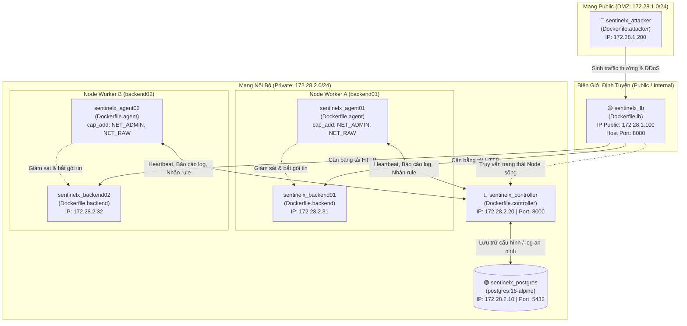

# SentinelX — Tài Liệu Kiến Trúc & Cú Pháp Docker (Docker & Compose Guide)

> **Mục tiêu:** Cung cấp tài liệu tổng hợp, chi tiết và có hệ thống về kiến trúc ảo hóa container, cú pháp câu lệnh trong các `Dockerfile`, cấu hình `compose.yaml` và vai trò của từng thành phần trong môi trường mô phỏng an toàn mạng **SentinelX (Đề tài PBL4)**.

---

## Mục Lục
1. [Tổng Quan Kiến Trúc Container SentinelX](#1-tổng-quan-kiến-trúc-container-sentinelx)
2. [Chi Tiết Cú Pháp Trong Dockerfile](#2-chi-tiết-cú-pháp-trong-dockerfile)
3. [Mục Đích & Vai Trò Của 5 Dockerfile Trong Dự Án](#3-mục-đích--vai-trò-của-5-dockerfile-trong-dự-án)
4. [Chi Tiết Cú Pháp Trong Docker Compose (`compose.yaml`)](#4-chi-tiết-cú-pháp-trong-docker-compose-composeyaml)
5. [Cẩm Nang Lệnh Thao Tác (Docker CLI Cheatsheet)](#5-cẩm-nang-lệnh-thao-tác-docker-cli-cheatsheet)

---

## 1. Tổng Quan Kiến Trúc Container SentinelX

Dự án SentinelX mô phỏng một hệ thống phân tán đa node thực tế với đầy đủ các phân vùng mạng (DMZ / Private), bao gồm bộ não điều khiển trung tâm, cụm backend chịu tải, bộ cân bằng tải phân phối traffic, agent an ninh thực thi tường lửa tại từng máy chủ và máy kẻ tấn công từ bên ngoài.

### Sơ Đồ Kiến Trúc Mạng & Container



### Bảng Phân Bổ Mạng & Cổng Dịch Vụ

| Container Name | Service | Mạng kết nối | Địa chỉ IPv4 tĩnh | Port Container | Port Host |
| :--- | :--- | :--- | :--- | :--- | :--- |
| `sentinelx_postgres` | PostgreSQL DB | `sentinelx_internal` | `172.28.2.10` | `5432` | Nội bộ |
| `sentinelx_controller` | FastAPI Central Controller | `sentinelx_internal` & `public` | `172.28.2.20` | `8000` | `8000` |
| `sentinelx_lb` | Load Balancer / Proxy | `sentinelx_public` & `internal` | `172.28.1.100` | `8080` | `8080` |
| `sentinelx_backend01` | Backend Workload 1 | `sentinelx_internal` | `172.28.2.31` | `8080` | Nội bộ |
| `sentinelx_backend02` | Backend Workload 2 | `sentinelx_internal` | `172.28.2.32` | `8080` | Nội bộ |
| `sentinelx_agent01` | Security Daemon 1 | `sentinelx_internal` | DHCP mạng nội bộ | - | Host kernel |
| `sentinelx_agent02` | Security Daemon 2 | `sentinelx_internal` | DHCP mạng nội bộ | - | Host kernel |
| `sentinelx_attacker` | Traffic Simulator | `sentinelx_public` | `172.28.1.200` | - | - |

---

## 2. Chi Tiết Cú Pháp Trong Dockerfile

Một `Dockerfile` là tập hợp các chỉ thị tuần tự nhằm xây dựng nên một **Docker Image**. Dưới đây là các cú pháp chuẩn được áp dụng trong toàn bộ dự án:

### 2.1. `FROM`
* **Cú pháp:** `FROM <image>:<tag>`
* **Ý nghĩa:** Khai báo base image nền tảng.
* **Thực tế:** `FROM python:3.12-slim` cung cấp môi trường Debian Linux tối giản có sẵn Python 3.12, giảm dung lượng image từ ~1GB xuống chỉ còn ~150MB.

### 2.2. `ENV`
* **Cú pháp:** `ENV KEY=VALUE ...`
* **Ý nghĩa:** Thiết lập các biến môi trường có hiệu lực xuyên suốt từ lúc build đến khi container chạy.
* **Các biến quan trọng:**
  * `PYTHONDONTWRITEBYTECODE=1`: Không sinh file `.pyc` thừa thãi.
  * `PYTHONUNBUFFERED=1`: Bắt Python flush log trực tiếp ra console (`stdout`/`stderr`), phục vụ realtime log streaming (`docker logs -f`).
  * `PYTHONPATH=/app/src`: Giúp Python giải quyết các câu lệnh import module trong thư mục mã nguồn `/app/src`.

### 2.3. `WORKDIR`
* **Cú pháp:** `WORKDIR <thư_mục>`
* **Ý nghĩa:** Đặt thư mục làm việc mặc định trong container. Các lệnh `RUN`, `COPY`, `CMD` tiếp theo sẽ được thực thi tại đường dẫn này.
* **Thực tế:** `WORKDIR /app`.

### 2.4. `RUN`
* **Cú pháp:** `RUN <lệnh_shell>`
* **Ý nghĩa:** Thực thi câu lệnh ngay trong lúc build image để cài đặt package hệ điều hành hoặc thư viện. Mỗi lệnh `RUN` tạo ra 1 filesystem layer mới.
* **Quy tắc tối ưu hoá:**
  * Nối các lệnh bằng `&& \`.
  * Luôn dọn dẹp cache sau khi cài đặt: `rm -rf /var/lib/apt/lists/*` và cờ `--no-cache-dir` của `pip` để giảm kích thước image.

### 2.5. `COPY` & Kỹ thuật Tận dụng Layer Caching
* **Cú pháp:** `COPY <đường_dẫn_máy_host> <đường_dẫn_container>`
* **Ý nghĩa:** Chép file/thư mục từ máy host vào bên trong image.
* **Chiến thuật Caching trong dự án:**
  ```dockerfile
  # Bước 1: Chỉ chép manifest cấu hình thư viện
  COPY pyproject.toml /app/
  RUN pip install --no-cache-dir .

  # Bước 2: Chép mã nguồn nghiệp vụ
  COPY src/ /app/src/
  COPY configs/ /app/configs/
  ```
  > **Lợi ích:** Quá trình cài đặt thư viện tốn nhiều thời gian nhưng ít khi thay đổi. Bằng cách tách biệt 2 bước, khi lập trình viên sửa code trong `src/`, Docker sẽ tái sử dụng cache của Bước 1, giúp tốc độ rebuild chỉ mất **1-2 giây**.

### 2.6. `EXPOSE`
* **Cú pháp:** `EXPOSE <cổng>`
* **Ý nghĩa:** Đóng vai trò như tài liệu kỹ thuật khai báo cổng mà ứng dụng lắng nghe bên trong container (ví dụ `EXPOSE 8000` hay `EXPOSE 8080`). Cổng này chỉ được mở ra máy host khi có khai báo `ports:` trong `compose.yaml`.

### 2.7. `HEALTHCHECK`
* **Cú pháp:** `HEALTHCHECK [tùy_chọn] CMD <câu_lệnh_test>`
* **Ý nghĩa:** Định nghĩa bài kiểm tra sức khỏe tự động của container.
* **Các tham số:**
  * `--interval=10s`: Tần suất chạy test (cứ 10 giây/lần).
  * `--timeout=5s`: Thời gian chờ tối đa cho 1 lần kiểm tra.
  * `--start-period=5s`: Thời gian ân hạn lúc container mới bật lên trước khi bắt đầu tính lỗi.
  * `--retries=3`: Số lần thất bại liên tiếp trước khi chuyển trạng thái thành `unhealthy`.
* **Ví dụ:**
  ```dockerfile
  HEALTHCHECK --interval=10s --timeout=5s --start-period=5s --retries=3 \
      CMD curl -f http://localhost:8000/api/v1/system/health || exit 1
  ```

### 2.8. `CMD`
* **Cú pháp:** `CMD ["tiến_trình", "tham_số_1", ...]` (Exec form - Khuyến nghị)
* **Ý nghĩa:** Lệnh mặc định sẽ được thực thi khi container khởi tạo.

---

## 3. Mục Đích & Vai Trò Của 5 Dockerfile Trong Dự Án

### 3.1. `deploy/docker/Dockerfile.controller`
* **Đối tượng:** Central Controller (FastAPI).
* **Mục đích:** Xây dựng máy chủ điều khiển trung tâm (Control Plane).
* **Vai trò:**
  * Cung cấp Dashboard quản trị và hệ thống REST API.
  * Tiếp nhận yêu cầu đăng ký (enrollment) và nhịp tim (heartbeat) định kỳ từ các Agent.
  * Đánh giá tình trạng an ninh và tự động phân phát quy tắc (firewall rules/policies) xuống các Node.
* **Thành phần cài thêm:** Cài `curl` để phục vụ `HEALTHCHECK` nội bộ kiểm tra trạng thái Controller trước khi các service khác kết nối vào.

### 3.2. `deploy/docker/Dockerfile.agent`
* **Đối tượng:** SentinelX Host Security Daemon.
* **Mục đích:** Đóng gói tiến trình giám sát và thực thi an toàn thông tin trực tiếp trên từng máy chủ worker.
* **Vai trò:**
  * Đóng vai trò là Host-based IPS/IDS (Intrusion Prevention / Detection System).
  * Lắng nghe chỉ thị từ Controller và trực tiếp thao tác vào bảng lọc gói tin của Linux Kernel để chặn IP độc hại, giới hạn tốc độ.
  * Bắt gói tin (sniffing) và thu thập thông số tài nguyên gửi về Controller.
* **Các công cụ hệ thống bắt buộc phải cài đặt:**
  * `iptables` & `nftables`: Cấu hình tường lửa tầng kernel Linux.
  * `iproute2`: Quản lý interface mạng và routing table.
  * `tcpdump`: Bắt và phân tích cấu trúc gói tin thô.
  * `procps`: Giám sát CPU/RAM và tiến trình hệ thống.

### 3.3. `deploy/docker/Dockerfile.backend`
* **Đối tượng:** Backend Workload App (`backend01`, `backend02`).
* **Mục đích:** Xây dựng dịch vụ ứng dụng web gọn nhẹ mô phỏng nghiệp vụ thực tế.
* **Vai trò:**
  * Là mục tiêu (Workload) cần được bảo vệ trước các mối đe dọa.
  * Tiếp nhận các HTTP request hợp lệ được định tuyến từ Load Balancer và phản hồi lại kết quả.
* **Đặc trưng:** Image siêu gọn (chỉ cài `aiohttp` và chạy file `app.py`), cách ly hoàn toàn với các công cụ can thiệp mạng.

### 3.4. `deploy/docker/Dockerfile.lb`
* **Đối tượng:** HTTP Load Balancer & Reverse Proxy.
* **Mục đích:** Xây dựng cổng ngõ tiếp nhận traffic tập trung.
* **Vai trò:**
  * Nằm ở vị trí DMZ (chân kết nối mạng ngoài Public và mạng trong Internal).
  * Đón nhận toàn bộ traffic hướng vào hệ thống tại cổng `8080`, phân phối đều cho `backend01` và `backend02`.
  * Có khả năng liên lạc với Controller để cập nhật danh sách node khỏe/chết (Health-aware Routing).

### 3.5. `deploy/docker/Dockerfile.attacker`
* **Đối tượng:** Red Team Simulator & Traffic Generator.
* **Mục đích:** Giả lập tác nhân bên ngoài môi trường mạng Internet.
* **Vai trò:**
  * Chạy kịch bản `attack_scenarios.py` nhắm vào địa chỉ của Load Balancer.
  * Mô phỏng 2 chế độ:
    1. **Normal Traffic:** Lưu lượng truy cập bình thường của người dùng để kiểm tra tính sẵn sàng.
    2. **Attack Scenarios:** Tấn công dồn dập (DDoS, SYN Flood, HTTP Flood) để kiểm thử năng lực phát hiện và tự động chặn của hệ thống SentinelX.
* **Công cụ tấn công tích hợp:**
  * `hping3`: Công cụ tạo gói tin TCP/IP tùy biến (SYN flood, UDP flood, IP spoofing).
  * `curl`: Sinh bão HTTP request để test giới hạn chịu tải ứng dụng (Layer 7).
  * `iputils-ping`: Kiểm tra liveness và ICMP flood.

---

## 4. Chi Tiết Cú Pháp Trong Docker Compose (`compose.yaml`)

File `compose.yaml` có nhiệm vụ ghép nối 5 thành phần trên vào một phòng lab mạng hoàn chỉnh:

### 4.1. Phân Vùng Mạng (`networks`)
```yaml
networks:
  sentinelx_public:
    name: sentinelx_public
    driver: bridge
    ipam:
      driver: default
      config:
        - subnet: 172.28.1.0/24

  sentinelx_internal:
    name: sentinelx_internal
    driver: bridge
    ipam:
      driver: default
      config:
        - subnet: 172.28.2.0/24
```
* **Mục đích:** Cách ly vùng mạng ngoài (`sentinelx_public`) với vùng mạng nội bộ (`sentinelx_internal`).
* **Cơ chế:** Kẻ tấn công trong `sentinelx_public` không thể gửi gói tin trực tiếp tới Database hay Backend ở `sentinelx_internal`, bắt buộc phải đi qua cổng kiểm soát của Load Balancer.

### 4.2. Vùng Nhớ Bền Vững (`volumes`)
```yaml
volumes:
  sentinelx_pgdata:
    name: sentinelx_pgdata
```
* **Mục đích:** Mount thư mục `/var/lib/postgresql/data` của PostgreSQL ra volume này. Khi khởi động lại hoặc xóa container, toàn bộ bảng cơ sở dữ liệu và cấu hình hệ thống không bị mất.

### 4.3. Các Chỉ Thị Cốt Lõi Trong Dịch Vụ (`services`)

#### A. Phân Nhóm Khởi Động Bằng `profiles`
Dự án chia làm 3 chế độ chạy tiện lợi:
* `profiles: [core]`: Chỉ khởi chạy Controller + PostgreSQL (tiết kiệm RAM khi dev tính năng Controller).
* `profiles: [lab]`: Bật toàn bộ cụm gồm Core + Load Balancer + 2 Backend Nodes + 2 Agent.
* `profiles: [attack]`: Bật toàn bộ Lab và kích hoạt thêm container Attacker để bắn tải.

#### B. Khởi Động Tuần Tự An Toàn (`depends_on` với `condition: service_healthy`)
```yaml
sentinelx_controller:
  depends_on:
    postgres_db:
      condition: service_healthy
```
> **Ý nghĩa:** Docker Compose sẽ không chỉ đợi container `postgres_db` khởi động, mà phải đợi đến khi câu lệnh `pg_isready` trong healthcheck của Postgres trả về thành công thì mới bắt đầu chạy `sentinelx_controller`. Điều này loại bỏ hoàn toàn lỗi crash do Controller cố kết nối vào DB khi DB chưa sẵn sàng.

#### C. Cấp Quyền Thao Tác Nhân Linux (`cap_add`)
```yaml
agent01:
  cap_add:
    - NET_ADMIN
    - NET_RAW
```
* **Bối cảnh:** Mặc định container bị cô lập và tước bỏ các quyền can thiệp hệ thống sâu.
* **Ý nghĩa:**
  * `NET_ADMIN`: Cho phép Agent chạy lệnh `iptables`/`nftables` để thêm/sửa/xóa quy tắc chặn gói tin của kernel.
  * `NET_RAW`: Cho phép Agent mở các raw sockets để bắt gói tin mạng bằng `tcpdump`.

#### D. Biến Môi Trường Với Giá Trị Mặc Định
* **Cú pháp:** `${TÊN_BIẾN:-giá_trị_mặc_định}`
* **Ví dụ:** `${SENTINELX_CONTROLLER_PORT:-8000}:8000`
  * Nếu máy host có đặt biến môi trường `SENTINELX_CONTROLLER_PORT=9000` thì mở port 9000.
  * Nếu không đặt, tự động lấy cổng mặc định là `8000`.

---

## 5. Cẩm Nang Lệnh Thao Tác (Docker CLI Cheatsheet)

Dưới đây là các câu lệnh hữu ích khi làm việc với phòng lab SentinelX:

### Khởi Chạy Hệ Thống Theo Profile

```bash
# 1. Chạy chỉ tầng Core (Controller + Database)
docker compose --profile core up -d

# 2. Chạy toàn bộ phòng Lab phòng thủ (Core + LB + Backends + Agents)
docker compose --profile lab up -d

# 3. Chạy đầy đủ Lab kèm kịch bản Tấn công (Core + Lab + Attacker)
docker compose --profile attack up -d --build
```

### Giám Sát & Gỡ Lỗi (Debugging)

```bash
# Xem trạng thái sức khỏe (health status) và IP của các container
docker compose ps

# Xem realtime log của toàn bộ hệ thống hoặc từng service
docker compose logs -f sentinelx_controller
docker compose logs -f agent01

# Truy cập vào shell của Agent để kiểm tra luật iptables đang áp dụng
docker exec -it sentinelx_agent01 bash
# (Bên trong container agent):
iptables -L -n -v

# Kiểm tra log tấn công từ container attacker
docker compose logs -f traffic_sim

# Dừng và xóa toàn bộ hệ thống
docker compose --profile attack down

# Xóa toàn bộ hệ thống kèm cả volume database
docker compose --profile attack down -v
```
